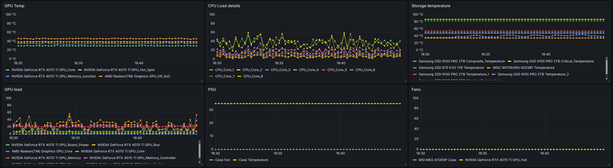

# Prometheus windows temperature exporter

Adds support of temperature metrics to prometheus [windows-exporter](https://github.com/prometheus-community/windows_exporter/tree/master), provided by [Libre Hardware Monitor](https://github.com/LibreHardwareMonitor/LibreHardwareMonitor) on Windows.

Simple to install and use.



Real metrics depends on your hardware and what sensors Libre Hardware Monitor can detect on your system.

## How it works

It works as service in background that uses Libre Hardware Monitor as DLL and outputs its data as prometheus metrics to file,
where windows_exporter can scrape them.

Metrics exported "as is" and labeled with hardware, hardware type and sensor type, so you can easily make any 
visualization on grafana dashboards:
```prometheus
Core_Tctl_Tdie{hardware="AMD Ryzen 9 9950X3D",hw_type="Cpu",index="2",sensor="Temperature"} 0.0
GPU_Memory_Total{hardware="AMD Radeon(TM) Graphics",hw_type="GpuAmd",index="2",sensor="SmallData"} 2048.0
GPU_Memory_Total{hardware="NVIDIA GeForce RTX 4070 Ti",hw_type="GpuNvidia",index="2",sensor="SmallData"} 12282.0
```

## Install

You should have [windows-exporter](https://github.com/prometheus-community/windows_exporter/tree/master) installed.

Enable files import in `windows-exporter`:
```powershell
notepad "C:\Program Files\Prometheus\windows_exporter\config.yml
```
For default installation it should be empty. Replace with:
```yaml
collectors:
  enabled: cpu,logical_disk,memory,net,os,physical_disk,service,system,textfile
```

Extract files of `prometheus-windows-exporter` from archive somewhere like `C:\Program Files\prometheus_win_temp`.

Install it as service (**run with administrator privileges**) and run:
```commandline
"C:\Program Files\prometheus_win_temp\service.exe" --startup auto install
"C:\Program Files\prometheus_win_temp\service.exe" start
```

Enjoy! Add new visualizations on your grafana dashboards. 
Some useful filters (from screen above):
```text
{instance="$instance", sensor="Temperature",hw_type=~"GpuNvidia|GpuAmd"}
{instance="$instance", hw_type="Cpu", sensor="Load", __name__=~"^CPU_Core_\\d+"}
{instance="$instance", sensor="Temperature",hw_type="Storage"}
{instance="$instance", hw_type=~"GpuAmd|GpuNvidia", sensor="Load", __name__=~"^GPU_.*"}
{instance="$instance", hw_type="Psu"}
{instance="$instance", sensor="Fan"}
```

### What else?

Edit config file for your taste:
```powershell
notepad "C:\Program Files\prometheus_win_temp\config.toml"
```
For example add sentry dsn for exceptions logging.

```toml
file_path = "C:\\Program Files\\windows_exporter\\textfile_inputs\\temp.prom"
period = 5
sensor_types = ["Temperature", "SmallData", "Load"]

[sentry]
dsn = "..."
environment = "dev"
```

You can run it as an executable:
```commandline
C:\Program Files\prometheus_win_temp\prometheus_win_temp.exe
```
It will print the metrics to the console.

### Build (for developers)
```bash
pip install py2exe
python3 build.py
xcopy dist "C:\Program Files\prometheus_win_temp" /E /Y
"C:\Program Files\prometheus_win_temp\service.exe" --startup auto install
```
